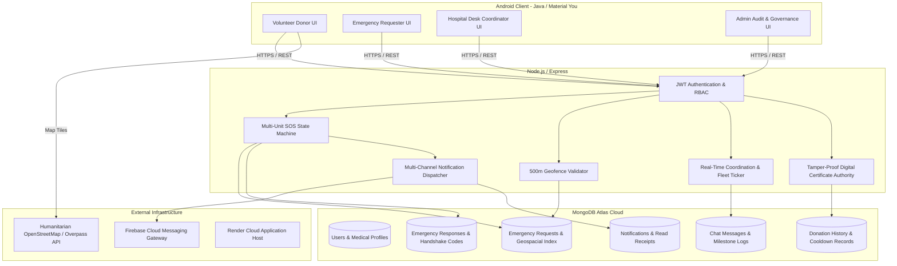
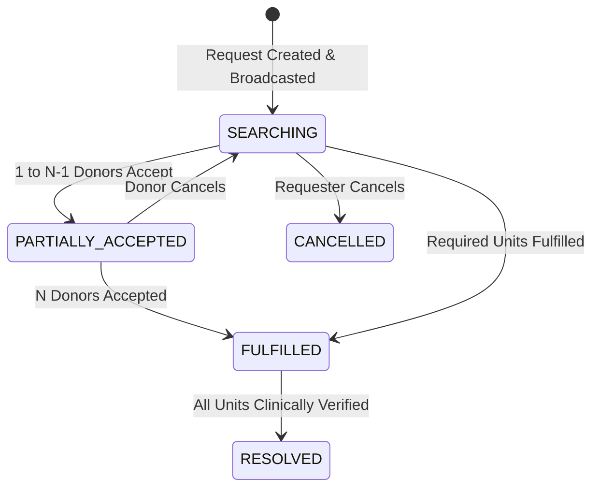

# LifeShare: Comprehensive Technical Documentation & Architecture Specification

**Version:** 2.4 (Production Release)  
**Repository:** [Abhijeet226/lifeShare](https://github.com/Abhijeet226/lifeShare)  
**System Classification:** Mission-Critical Humanitarian Blood Delivery & Emergency Response Platform  

---

## 1. Executive Summary & Core Purpose

**LifeShare** is an enterprise-grade, real-time voluntary blood donation and emergency SOS response platform. It bridges the critical time gap between hospital blood deficits and volunteer donors through:
* **Multi-Unit SOS Broadcasts**: Dynamic radius matching based on geospatial coordinates and blood group compatibility.
* **Live In-App Humanitarian GPS Tracking**: Battery-efficient, adaptive geofenced tracking of voluntary donors on OpenStreetMap.
* **Zero-Spam Coordination Chat**: Pinned dynamic fleet transit tickers and quick milestone action chips.
* **Physical 2FA Handshake with 500m Geofence Lock**: Tamper-proof verification preventing fraudulent remote donation claims.
* **Clinical Verification & Cryptographic Certificates**: Hospital medical officer certification, QR tamper validation, and 90-day cooldown enforcement.
* **Multi-Channel Notification Infrastructure**: Real-time FCM push notifications, in-app notification center, and deep linking.

---

## 2. System Architecture



---

## 3. Core Subsystems & Technical Workflows

### 3.1 Multi-Unit SOS Emergency Engine & Lifecycle
Emergency requests specify `unitsRequired` (e.g. 3 units). The backend manages a multi-donor response pool through a state machine:



#### Individual Donor Journey Lifecycle
1. **`NOTIFIED`**: Donor is matched by blood compatibility and geographical distance ($r \le 15\text{ km}$).
2. **`ACCEPTED`**: Donor commits to donate. Backend verifies that donor is not in a **90-day cooldown period**.
3. **`TRAVELLING`**: Donor begins transit. GPS coordinates stream to the coordination room.
4. **`ARRIVED`**: Enforces a **500-meter GPS Geofence**. Generates a dynamic **4-digit Handshake Code**.
5. **`DONATED` / `COMPLETED`**: Coordinator enters the handshake code, doctor registration details, and issues certificate.

---

### 3.2 2FA Physical Handshake with 500m Geofence Lock
To eliminate fake or remote donation fraud:
1. **Geofence Validation**: When donor taps *"I've Arrived at Hospital"*, the client captures high-precision GPS coordinates:
   $$\text{Haversine}(lat_D, lng_D, lat_H, lng_H) \le 500\text{ meters}$$
   If $>500\text{m}$, the request is rejected: *"You are currently X km away. Arrival can only be confirmed within 500m of the hospital perimeter."*
2. **Handshake Generation**: Upon valid arrival, the server generates a random 4-digit code:
   $$\text{Handshake Code} = \lfloor 1000 + \text{rand}() \times 9000 \rfloor$$
3. **Counter Verification**: The hospital desk coordinator enters the 4-digit code presented by the physical donor. Once verified, the donation certificate is minted.

```
┌─────────────────────────────────────────────────────────────┐
│ 📍 GEOFENCE & 2FA VERIFICATION WORKFLOW                     │
│                                                             │
│  [Donor Phone]                      [Hospital Desk Portal]  │
│         │                                      │            │
│         ├── (1) Taps "I've Arrived" (GPS) ───►│            │
│         │   [Verified within 500m]             │            │
│         │                                      │            │
│         │◄── (2) Displays [ 8 4 9 2 ] ─────────┤            │
│         │                                      │            │
│         ├── (3) Donor presents [ 8 4 9 2 ] ───►│            │
│         │                                      │            │
│         │◄── (4) Verified & Certificate Issued ┤            │
└─────────────────────────────────────────────────────────────┘
```

---

### 3.3 Zero-Spam Coordination Chat with Live Fleet Ticker
In [`EmergencyChatActivity.java`](file:///e:/BloodBank/app/src/main/java/com/example/abhijeet/bloodbank/EmergencyChatActivity.java):
* **Pinned Live Fleet Banner**: Instead of generating chat spam messages for every ETA change, a top pinned header card updates in-place:
  * **Single Donor**: `🚗 Transit: Rahul (O+) ~7m away (1.8 km)`
  * **Multiple Donors**: `🚗 Fleet (2 En Route): Rahul (O+) ~7m • Priya (O+) ~14m`
* **Milestone Quick Chips**: 5 pre-configured milestone actions:
  1. `On My Way` (`🚗 On my way to the hospital`)
  2. `In Heavy Traffic` (`🚦 Delayed in heavy traffic, still travelling`)
  3. `Reached Gate` (`🏥 Reached Hospital Main Gate`)
  4. `At Blood Bank Desk` (`📍 Present at Blood Bank Verification Desk`)
  5. `Donation Started` (`🩸 Blood donation procedure started`)
* **Offline Staging Queue**: If network connectivity drops in elevators or basements, outgoing messages are queued in memory and automatically flushed upon reconnection.

---

### 3.4 Adaptive Geofenced GPS Engine
In [`LiveDonorTrackingActivity.java`](file:///e:/BloodBank/app/src/main/java/com/example/abhijeet/bloodbank/LiveDonorTrackingActivity.java):
* Dynamic scaling of polling frequency to maximize battery preservation during travel:
  * $\text{Distance} > 2.0\text{ km} \implies 10\text{s interval}$ (Battery-Saving Transit Mode)
  * $1.0\text{ km} \le \text{Distance} \le 2.0\text{ km} \implies 5\text{s interval}$ (Standard Mode)
  * $\text{Distance} \le 1.0\text{ km} \implies 3\text{s interval}$ (High-Precision Arrival Mode)

---

### 3.5 Tamper-Proof Certificate Authority & Social Sharing
* **SHA-256 Tamper Validation**:
  $$\text{Hash} = \text{SHA256}(\text{CertID} + \text{DonorID} + \text{HospitalID} + \text{DoctorRegNo} + \text{Date})$$
* **Public QR Verification**: QR code on certificate resolves to `https://lifeshare-74c2.onrender.com/api/certificates/:certId`.
* **WhatsApp / Social Share**: Native Android `Intent.ACTION_SEND` formats a celebratory milestone message with verification link.

---

## 4. Database Schema Specifications

### 4.1 `EmergencyRequest` Schema
```javascript
{
  patientName: { type: String, required: true },
  hospital: { type: String, required: true },
  hospitalId: { type: mongoose.Schema.Types.ObjectId, ref: 'Hospital' },
  hospitalAddress: { type: String },
  hospitalLocation: {
    type: { type: String, enum: ['Point'], default: 'Point' },
    coordinates: { type: [Number], required: true } // [Longitude, Latitude]
  },
  city: { type: String, default: 'Bhubaneswar' },
  cityId: { type: mongoose.Schema.Types.ObjectId, ref: 'City' },
  bloodGroup: { type: String, required: true, enum: ['A+','A-','B+','B-','AB+','AB-','O+','O-'] },
  unitsRequired: { type: Number, default: 1 },
  unitsFulfilled: { type: Number, default: 0 },
  acceptedCount: { type: Number, default: 0 },
  urgency: { type: String, enum: ['CRITICAL', 'HIGH', 'URGENT', 'STANDARD'], default: 'URGENT' },
  status: { type: String, enum: ['SEARCHING', 'PARTIALLY_ACCEPTED', 'FULFILLED', 'RESOLVED', 'CANCELLED', 'EXPIRED'], default: 'SEARCHING' },
  contactNumber: { type: String, required: true },
  postedBy: { type: String, required: true }, // User Email / ID
  expiresAt: { type: Date }
}
```

### 4.2 `EmergencyResponse` Schema
```javascript
{
  requestId: { type: mongoose.Schema.Types.ObjectId, ref: 'EmergencyRequest', required: true, index: true },
  donorId: { type: mongoose.Schema.Types.ObjectId, ref: 'User', required: true, index: true },
  status: { 
    type: String, 
    enum: ['NOTIFIED', 'VIEWED', 'ACCEPTED', 'DECLINED', 'TRAVELLING', 'ARRIVED', 'DONATED', 'CANCELLED', 'COMPLETED'],
    default: 'NOTIFIED'
  },
  handshakeCode: { type: String, default: '' },
  etaMinutes: { type: Number, default: 0 },
  notifiedAt: { type: Date, default: Date.now },
  viewedAt: { type: Date },
  acceptedAt: { type: Date },
  travellingAt: { type: Date },
  arrivedAt: { type: Date },
  donatedAt: { type: Date },
  completedAt: { type: Date }
}
```

### 4.3 `DonationHistory` Schema
```javascript
{
  donorId: { type: mongoose.Schema.Types.ObjectId, ref: 'User', required: true, index: true },
  requestId: { type: mongoose.Schema.Types.ObjectId, ref: 'EmergencyRequest' },
  hospitalId: { type: mongoose.Schema.Types.ObjectId, ref: 'Hospital' },
  hospitalName: { type: String, required: true },
  bloodGroup: { type: String, required: true },
  unitsDonated: { type: Number, default: 1 },
  certificateId: { type: String, unique: true },
  certificateHash: { type: String },
  attendingDoctor: { type: String, default: 'Attending Medical Officer' },
  doctorRegistrationNo: { type: String },
  verifiedBy: { type: mongoose.Schema.Types.ObjectId, ref: 'User' },
  donationDate: { type: Date, default: Date.now },
  nextEligibleDate: { type: Date }, // +90 days cooldown
  status: { type: String, enum: ['COMPLETED', 'CANCELLED'], default: 'COMPLETED' }
}
```

---

## 5. REST API Specifications

### 5.1 Emergency SOS & Donor Journey Endpoints

| Method | Endpoint | Description | Auth Role |
|---|---|---|---|
| `POST` | `/api/emergencies` | Broadcast new emergency SOS | All Users |
| `GET` | `/api/emergencies/:id` | Fetch emergency details, my journey, and donor roster | All Users |
| `POST` | `/api/emergencies/:id/journey` | Update journey state (`ACCEPTED`, `TRAVELLING`, `ARRIVED`, `CANCELLED`) | Donor |
| `GET` | `/api/emergencies/:id/tracking` | Get live coordinates and ETAs of all responding donors | Requester / Coordinator |

#### Sample Request: `POST /api/emergencies/:id/journey` (Arrival Confirmation)
```json
{
  "action": "ARRIVED",
  "latitude": 20.2291,
  "longitude": 85.7772
}
```

#### Sample Response: Success (200 OK)
```json
{
  "success": true,
  "message": "Arrival at hospital confirmed. Please present your 4-digit verification code to the blood bank desk.",
  "responseStatus": "ARRIVED",
  "handshakeCode": "8492",
  "myJourney": {
    "status": "ARRIVED",
    "handshakeCode": "8492",
    "isPendingVerification": true
  }
}
```

---

### 5.2 Hospital Coordinator Verification Endpoints

| Method | Endpoint | Description | Auth Role |
|---|---|---|---|
| `GET` | `/api/emergencies/coordinator/pending-verifications` | Queue of arrived donors awaiting certification | `COORDINATOR` / `ADMIN` |
| `POST` | `/api/emergencies/:id/verify-donation` | Certify donation with 4-digit code and issue certificate | `COORDINATOR` / `ADMIN` |

#### Sample Request: `POST /api/emergencies/:id/verify-donation`
```json
{
  "donorId": "651a2b3c4d5e6f7a8b9c0d1e",
  "doctorName": "Dr. R. K. Mishra",
  "doctorRegistrationNo": "MCI-58492",
  "unitsDonated": 1,
  "handshakeCode": "8492",
  "isOverride": false
}
```

---

## 6. Android Client Architecture

* **UI Layer**: Native Android Views with Google Material 3 / Material You design guidelines. Full Edge-to-Edge window support via `WindowHelper.applyEdgeToEdge()`.
* **Networking & Resilience**: Singleton [`ApiClient`](file:///e:/BloodBank/app/src/main/java/com/example/abhijeet/bloodbank/ApiClient.java) using `OkHttp3` with automatic token refresh, offline message staging, and exponential backoff retry.
* **Geospatial & Navigation**: `OSMDroid` tile engine with Humanitarian HOT cartography overlay and native Google Maps Turn-by-Turn fallback via `Uri.parse("google.navigation:q=...")`.

---

## 7. Security, Cooldown, and Governance Matrix

1. **Role-Based Access Control (RBAC)**:
   * `DONOR`: Can view broadcasts, accept, update journey, view certificates.
   * `RECIPIENT` / `REQUESTER`: Can broadcast SOS, track assigned fleet, view donors.
   * `COORDINATOR`: Hospital-scoped authority to audit, verify handshake codes, and issue certified bags.
   * `ADMIN`: Platform-wide governance, hospital onboarding, user suspensions, and audit logs.
2. **90-Day Medical Cooldown**:
   * Calculated atomically: `nextEligibleDate = donationDate + 90 days`.
   * Donors within cooldown are barred from accepting new SOS broadcasts and marked with cooldown badges in search.

---

## 8. Deployment & Environment Configuration

### Backend Environment Variables (`.env`)
```bash
PORT=5000
NODE_ENV=production
MONGO_URI=mongodb+srv://<username>:<password>@cluster0.mongodb.net/bloodbank?retryWrites=true&w=majority
JWT_SECRET=your_jwt_strong_secret
FIREBASE_SERVICE_ACCOUNT={"type":"service_account",...}
```

### Android Client Build Configuration (`build.gradle`)
* `compileSdk`: 35
* `minSdk`: 24
* `targetSdk`: 35
* `Java Version`: 17 / JVM Desugaring enabled
